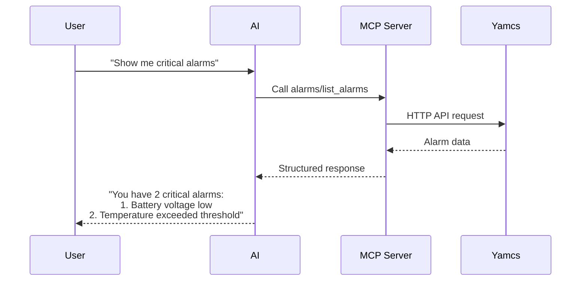

# Understanding MCP

## What is MCP?

The Model Context Protocol (MCP) is a standardized protocol that enables AI assistants to interact with external systems through **tools** and **resources**. Think of it as a bridge between AI assistants (like Claude) and your mission control systems.

## MCP vs Traditional APIs

Unlike REST APIs that you call directly with code, MCP servers expose **tools** that AI assistants can use on your behalf:

| Traditional API | MCP Server |
|-----------------|------------|
| You write code to call endpoints | You ask the AI to use tools |
| Returns JSON data | AI interprets and presents results |
| Requires programming knowledge | Works with natural language |
| Direct HTTP/WebSocket calls | AI handles the protocol |

## Core Concepts

### Tools

Tools are functions the AI can call to perform actions or retrieve data. When you ask "Show me all active alarms", the AI uses the `alarms/list_alarms` tool behind the scenes.

**Example interaction:**
```
You: "What's the battery voltage?"
AI: [Uses mdb/describe_parameter tool with parameter="/YSS/SIMULATOR/BatteryVoltage"]
AI: "The battery voltage is currently 28.5V"
```

### Resources

Resources are URIs that provide formatted information. Think of them as pre-formatted reports or summaries.

**Available resources in this server:**
- `mdb://parameters` - Summary of parameters in the Mission Database
- `processors://list` - List of all processors and their states
- `links://status` - Current status of all data links
- `alarms://list` - Summary of active alarms

### Tool Naming Convention

All tools follow a consistent pattern: `category/action_target`

Examples:
- `mdb/list_parameters` - List parameters from Mission Database
- `links/enable_link` - Enable a specific data link
- `alarms/acknowledge_alarm` - Acknowledge an alarm

## How It Works

1. **You connect** the MCP server to your AI assistant (like Claude Desktop)
2. **The server registers** all available tools with the AI
3. **You ask questions** in natural language
4. **The AI determines** which tools to use
5. **Tools execute** and return data
6. **The AI presents** the results in a human-friendly way

## Tool Categories

The Yamcs MCP Server organizes tools into logical categories:

| Category | Purpose | Example Tools |
|----------|---------|---------------|
| **MDB** | Mission Database queries | `list_parameters`, `describe_command` |
| **Processors** | Real-time data processing | `describe_processor`, `get_parameter_value` |
| **Links** | Data link management | `list_links`, `enable_link`, `disable_link` |
| **Storage** | Object storage | `list_buckets`, `upload_object` |
| **Instances** | Yamcs instance control | `list_instances`, `start_instance` |
| **Alarms** | Alarm monitoring | `list_alarms`, `acknowledge_alarm` |

## Benefits of MCP

### For Operators
- Use natural language instead of memorizing commands
- Get intelligent interpretation of data
- Combine multiple operations easily
- No programming required

### For Mission Control
- Standardized interface to Yamcs
- Built-in error handling
- Automatic retry logic
- Consistent response format

### For AI Assistants
- Structured tool definitions
- Type-safe parameters
- Clear error messages
- Predictable behavior

## Example Workflow

Here's how a typical interaction flows:



## Best Practices

### Clear Requests
Instead of: "Check the system"  
Better: "Show me all active alarms and disabled links"

### Specific Parameters
Instead of: "Get battery info"  
Better: "Show me the current value and alarm limits for BatteryVoltage parameter"

### Batch Operations
Instead of asking one by one, combine related requests:  
"Check the health of the realtime processor, list any alarms on it, and show the telemetry link status"

## Next Steps

- Review [Sample Prompts](sample-prompts.md) for practical examples
- Check the [Tools Reference](tools-overview.md) for available tools
- Follow the [Quick Start](quickstart.md) guide to begin using the server